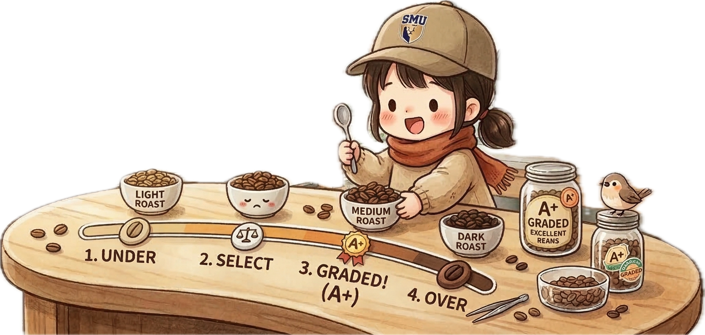
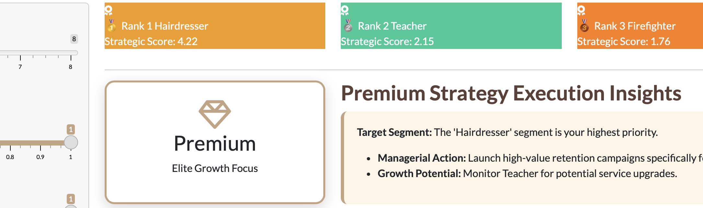
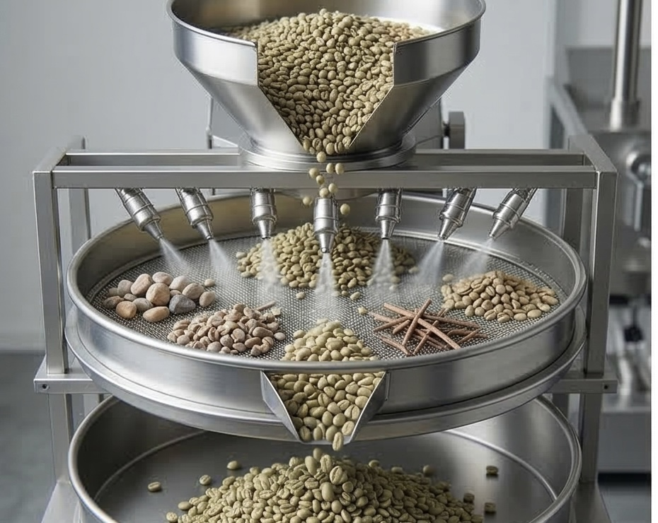
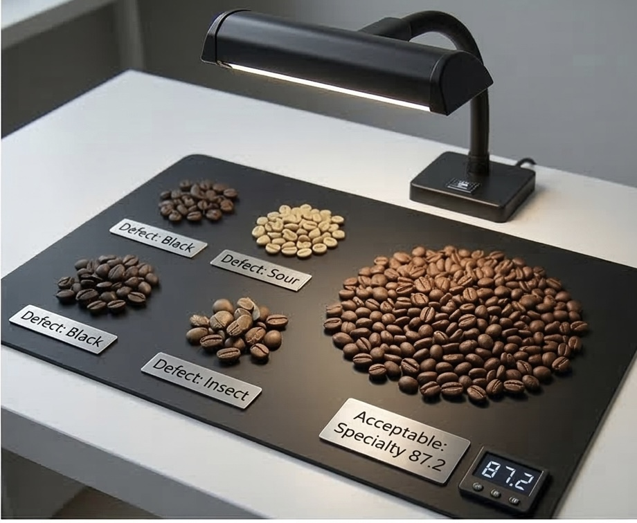
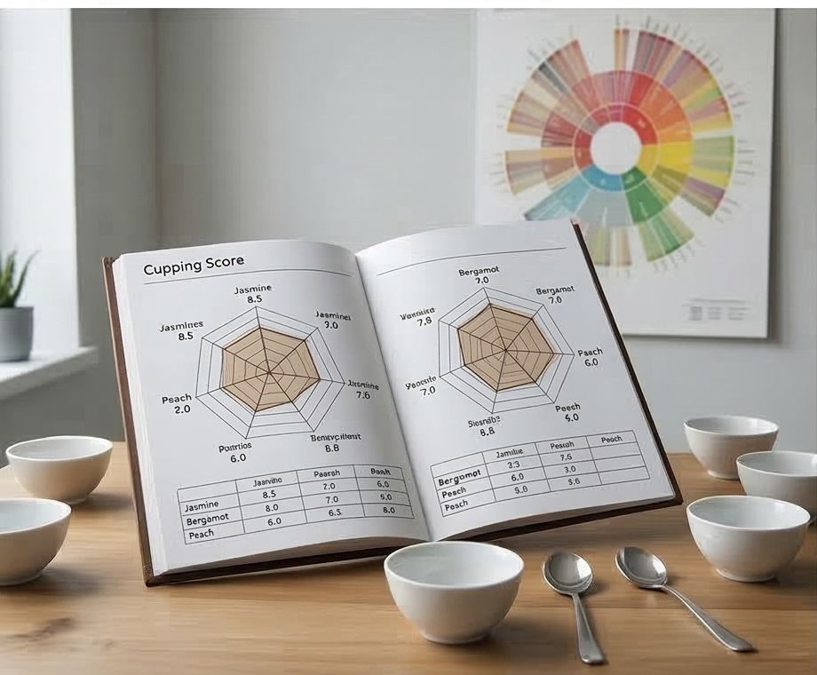
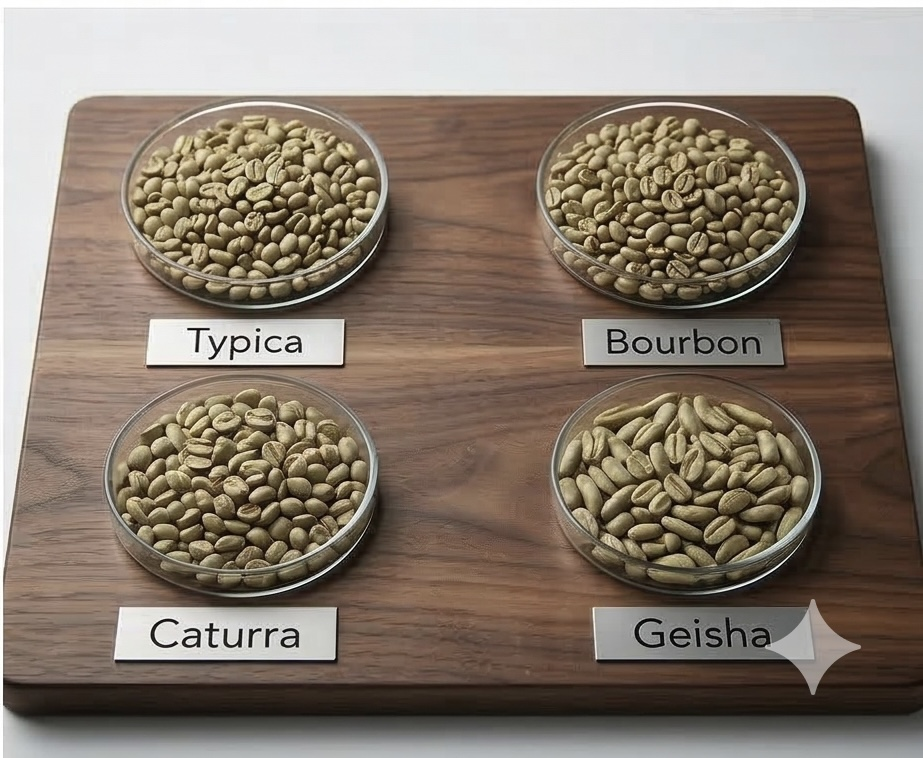

::: {#home .hero-section .column-screen}
## Bean Counting 2.0 <br> Shifting Loyal Beans from At-Risk Grinds

Decoding customer behavior through Visual Analytics. <br> Transforming churn data into brewing success.

[Explore the Analytics](https://data.mendeley.com/datasets/mhb4zn3258/1){.btn .btn-outline-light .btn-lg role="button" target="_blank"}
:::

::::::::: {#introduction .content-section .column-screen style="padding: 20px 5%; background-color: #FDF5E6;"}
::: {style="text-align: center; margin-bottom: 20px;"}
<h2 style="margin: 0; border: none;">

The Art of Data Brewing: From Seed to Sip

</h2>
:::

::: {style="max-width: 800px; margin: 0 auto; text-align: center; margin-bottom: 40px; font-size: 1rem; line-height: 1.5;"}
In the world of specialty coffee, moving from a raw seed to a perfect cup requires precision, grading, and constant monitoring. Similarly, our project treats raw banking data as **"green beans,"** applying visual analytics and machine learning to refine them into actionable business insights.
:::

:::::: {.grid .text-center style="width: 100%;"}
::: {.g-col-12 .g-col-md-4 .intro-card}


<h3 class="single-line-title">

Harvesting Insight

</h3>

<p class="intro-subtitle">

Analysing Spending Behaviours

</p>

<p class="card-body-text">

Just as harvesting ripe cherries is the foundation of quality, understanding transaction frequency and volume serves as our "origin" data.

</p>
:::

::: {.g-col-12 .g-col-md-4 .intro-card}


<h3 class="single-line-title">

Grading the Roast

</h3>

<p class="intro-subtitle">

Comparing Occupations

</p>

<p class="card-body-text">

Green beans must be meticulously graded. We treat "Occupation" as a critical grading metric to identify "premium segments."

</p>
:::

::: {.g-col-12 .g-col-md-4 .intro-card}


<h3 class="single-line-title">

The Final Cupping

</h3>

<p class="intro-subtitle">

Churn Probability Prediction

</p>

<p class="card-body-text">

Predicting churn is like cupping for defects. Using predictive modeling, we act as a quality control layer to ensure relationships remain bold.

</p>
:::
::::::
:::::::::

------------------------------------------------------------------------

:::: {#shiny-app .content-section .column-screen style="padding: 60px 5%; background-color: #FDF5E6;"}

```{=html}
<div style="text-align: center; margin-bottom: 40px;">
    <div style="display: flex; align-items: center; justify-content: center; gap: 20px; margin-bottom: 15px;">
        <div style="width: 60px; height: 2px; background-color: #D4A373;"></div>
        <h2 style="margin: 0; border: none; font-family: 'Montserrat', sans-serif; letter-spacing: 4px; color: #3C2A21; font-weight: 800;">RSHINY APP</h2>
        <div style="width: 60px; height: 2px; background-color: #D4A373;"></div>
    </div>
    <p style="font-family: 'Lora', serif; color: #666; font-size: 1.1rem; margin: 5px 0;">Understand the spending nature of customers.</p>
</div>

<div style="max-width: 1000px; margin: 0 auto; background: white; border-radius: 20px; overflow: hidden; box-shadow: 0 25px 60px rgba(60, 42, 33, 0.15); display: flex; flex-direction: column; align-items: center; border: 1px solid rgba(60, 42, 33, 0.1);">
    
    <div style="width: 100%; height: 400px; overflow: hidden; position: relative;">
        
        <div style="position: absolute; top: 0; left: 0; width: 100%; height: 100%; background: linear-gradient(transparent, rgba(255,255,255,0.98));"></div>
    </div>

    <div style="padding: 0 40px 50px 40px; text-align: center; margin-top: -60px; z-index: 2; width: 100%;">
        <h3 style="font-family: 'Playfair Display', serif; color: #3C2A21; font-size: 2rem; margin-bottom: 15px;">Interactive Customer Dashboard</h3>
        <p style="color: #666; font-family: 'Lora', serif; line-height: 1.6; margin-bottom: 35px; max-width: 600px; margin-left: auto; margin-right: auto;">
            Experience our comprehensive visual analytics platform. Explore customer segments, analyze spending behaviors, and predict churn risks through our real-time interactive dashboard.
        </p>

        <a href="[https://coop3r0401.shinyapps.io/DashBoard/](https://coop3r0401.shinyapps.io/DashBoard/)" target="_blank" 
           style="background-color: #3C2A21; color: #FDF5E6; padding: 20px 50px; border-radius: 50px; text-decoration: none; font-family: 'Montserrat', sans-serif; font-weight: 700; letter-spacing: 2px; transition: 0.3s; display: inline-block; box-shadow: 0 10px 25px rgba(60, 42, 33, 0.3); font-size: 0.9rem;">
           EXPLORE THE ANALYTICS DASHBOARD
        </a>
        
        <p style="margin-top: 30px; font-size: 0.8rem; color: #D4A373; font-style: italic; font-family: 'Montserrat', sans-serif;">
            * Best viewed on desktop for an optimal interactive experience.
        </p>
    </div>
</div>
```
::::

------------------------------------------------------------------------

:::::: {#poster .content-section .column-screen style="padding: 40px 5%; background-color: #FDF5E6;"}
::: {style="text-align: center; margin-bottom: 30px;"}
<h2 style="border: none;">

🖼️ Project Poster

</h2>
:::

:::: {style="max-width: 1000px; margin: 0 auto; box-shadow: 0 10px 30px rgba(0,0,0,0.1); border-radius: 10px; overflow: hidden; background: white;"}


::: {style="padding: 20px; text-align: center; background: #3C2A21;"}
<a href="poster.pdf" class="btn btn-outline-light" target="_blank">Download Poster (PDF)</a>
:::
::::
::::::

------------------------------------------------------------------------

:::::::::::::::::::::::::::::: {#prototypes .prototype-hero-section .column-screen}
::: proto-header-content
<h2 style="border: none;">

Prototypes

</h2>

<p>Explore our data refinery process, from raw sorting to the final predictive brew.</p>
:::

:::::::::::::::::::::::::::: prototype-slider
::::::: proto-card
::::: proto-img-wrapper
::: proto-number
01
:::



::: proto-overlay
<a href="https://tiny-swan-f01c9c.netlify.app/proposal/data_preparation" class="btn btn-light" target="_blank">View Analysis</a>
:::
:::::

::: proto-info
<p class="proto-tag">

Data Preparation

</p>

<h4>Cleaning the Beans</h4>

<p>Filtering and structuring "green" data to ensure every observation meets our quality standards.</p>
:::
:::::::

::::::: proto-card
::::: proto-img-wrapper
::: proto-number
02
:::



::: proto-overlay
<a href="https://tiny-swan-f01c9c.netlify.app/proposal/eda" class="btn btn-light" target="_blank">View Analysis</a>
:::
:::::

::: proto-info
<p class="proto-tag">

Exploratory Analysis

</p>

<h4>Visual Grading</h4>

<p>Uncovering the hidden aroma of consumer behavior through visual distributions and trend discovery.</p>
:::
:::::::

::::::: proto-card
::::: proto-img-wrapper
::: proto-number
03
:::



::: proto-overlay
<a href="https://tiny-swan-f01c9c.netlify.app/proposal/cda" class="btn btn-light" target="_blank">View Analysis</a>
:::
:::::

::: proto-info
<p class="proto-tag">

Confirmative Analysis

</p>

<h4>Flavor Profiling</h4>

<p>Testing statistical hypotheses to confirm core variables that define loyal vs. at-risk customers.</p>
:::
:::::::

::::::: proto-card
::::: proto-img-wrapper
::: proto-number
04
:::



::: proto-overlay
<a href="https://tiny-swan-f01c9c.netlify.app/proposal/clustering_analysis" class="btn btn-light" target="_blank">View Analysis</a>
:::
:::::

::: proto-info
<p class="proto-tag">

Clustering Analysis

</p>

<h4>Varietal Sorting</h4>

<p>Segmenting customers into distinct "bean profiles" to identify specific groups prone to churning.</p>
:::
:::::::

::::::: proto-card
::::: proto-img-wrapper
::: proto-number
05
:::


::: proto-overlay
<a href="https://tiny-swan-f01c9c.netlify.app/proposal/decision_tree" class="btn btn-light" target="_blank">View Analysis</a>
:::
:::::

::: proto-info
<p class="proto-tag">

Decision Tree

</p>

<h4>The Extraction Logic</h4>

<p>Developing automated logic to predict churn risks and optimize our retention brewing strategy.</p>
:::
:::::::
::::::::::::::::::::::::::::
::::::::::::::::::::::::::::::

------------------------------------------------------------------------

::::::: {#team .content-section .column-screen style="padding: 25px 5%; background-color: #FDF5E6;"}
## 👥 The Roasting Team

:::::: {.grid .text-center style="width: 100%;"}
::: g-col-4
#### **DODDAPANENI Virinchi**
:::

::: g-col-4
#### **SU Bo-Han (Cooper)**
:::

::: g-col-4
#### **YU DONGHUI**
:::
::::::
:::::::

------------------------------------------------------------------------

::::::: {#contact .content-section .column-screen style="padding: 40px 5%; background-color: #3C2A21; color: #EDE0D4; text-align: center;"}
<h2 style="color: #EDE0D4; border: none; margin-bottom: 30px;">

☕ Contact Us

</h2>

:::::: grid
::: {.g-col-12 .g-col-md-4}
#### **DODDAPANENI Virinchi**

[Email Me](mailto:virinchi@example.com){style="color: #D4A373; text-decoration: none;"}
:::

::: {.g-col-12 .g-col-md-4}
#### **SU Bo-Han (Cooper)**

[Email Me](mailto:s7320401@gmail.com){style="color: #D4A373; text-decoration: none;"}
:::

::: {.g-col-12 .g-col-md-4}
#### **YU DONGHUI**

[Email Me](mailto:yu@example.com){style="color: #D4A373; text-decoration: none;"}
:::
::::::
:::::::


```{=html}
<style>
/* --- 0. Fonts --- */
@import url('[https://fonts.googleapis.com/css2?family=Montserrat:wght@400;700;800&family=Playfair+Display:ital,wght@0,700;1,700&family=Lora:ital,wght@0,400;0,700;1,400&display=swap](https://fonts.googleapis.com/css2?family=Montserrat:wght@400;700;800&family=Playfair+Display:ital,wght@0,700;1,700&family=Lora:ital,wght@0,400;0,700;1,400&display=swap)');

/* --- 1. Global --- */
html, body {
  margin: 0; padding: 0; overflow-x: hidden;
  background-color: #FDF5E6; color: #3C2A21;
  font-family: 'Lora', serif !important;
}
.quarto-content, .page-columns { max-width: 100% !important; }
.content-section { width: 100% !important; margin: 0 !important; }

/* --- 2. Hero Section --- */
.hero-section.column-screen {
  background: linear-gradient(rgba(60, 42, 33, 0.75), rgba(60, 42, 33, 0.75)), 
              url('coffee-bg.png') no-repeat center center; 
  background-size: cover; min-height: 85vh; 
  display: flex !important; flex-direction: column !important;
  justify-content: center !important; align-items: center !important;
  text-align: center !important; padding: 100px 20px !important; color: #FDF5E6 !important;
}
.btn-outline-light {
  margin-top: 30px; border: 2px solid #FDF5E6 !important; color: #FDF5E6 !important;
  padding: 12px 35px !important; text-decoration: none !important;
  font-family: 'Montserrat', sans-serif !important; font-weight: 700 !important;
  border-radius: 8px !important; text-transform: uppercase !important; letter-spacing: 1.5px;
  display: inline-block; transition: 0.3s;
}
.btn-outline-light:hover { background-color: #FDF5E6 !important; color: #3C2A21 !important; transform: translateY(-3px); }

/* --- 3. Prototype Hero-Style Section (完全對標 Hero 區塊) --- */
.prototype-hero-section {
  padding: 100px 5%;
  /* 把這裡的 'lab-bg.png' 換成你想要的圖片名稱 */
  background: linear-gradient(rgba(60, 42, 33, 0.8), rgba(60, 42, 33, 0.8)), 
              url('coffee-bg2.png') no-repeat center center;
  background-size: cover;
  background-attachment: fixed; /* 視差滾動 */
  color: #FDF5E6 !important;
  text-align: center;
}

.proto-header-content h2 {
  font-family: 'Playfair Display', serif !important;
  color: #FDF5E6 !important;
  font-size: 2.2rem !important;
  margin-bottom: 20px;
}

.proto-header-content p {
  color: #D4A373;
  font-family: 'Montserrat', sans-serif;
  font-weight: 700;
  text-transform: uppercase;
  letter-spacing: 2px;
  margin-bottom: 50px;
}

/* 滾動容器與卡片樣式維持不變，但在深色背景下更亮眼 */
.prototype-slider {
  display: flex; overflow-x: auto; gap: 30px;
  padding: 20px 10px 40px 10px; scroll-snap-type: x mandatory;
  scrollbar-width: thin; scrollbar-color: #D4A373 transparent;
}
.prototype-slider::-webkit-scrollbar { height: 8px; }
.prototype-slider::-webkit-scrollbar-thumb { background: #D4A373; border-radius: 10px; }

.proto-card {
  min-width: 320px; background: white; border-radius: 20px;
  overflow: hidden; box-shadow: 0 20px 40px rgba(0,0,0,0.3);
  transition: 0.4s; flex: 0 0 auto; scroll-snap-align: start;
  border: none; display: flex; flex-direction: column;
}
.proto-card:hover { transform: translateY(-15px); }

.proto-img-wrapper { position: relative; height: 210px; overflow: hidden; }
.proto-img-wrapper img { width: 100%; height: 100%; object-fit: cover; transition: 0.5s; }
.proto-card:hover .proto-img-wrapper img { transform: scale(1.1); }

.proto-number {
  position: absolute; top: 15px; left: 15px; background: rgba(60, 42, 33, 0.9);
  color: #fff; padding: 4px 12px; border-radius: 20px; font-size: 0.75rem; font-weight: 700; z-index: 2;
}
.proto-overlay {
  position: absolute; top: 0; left: 0; width: 100%; height: 100%;
  background: rgba(60, 42, 33, 0.75); display: flex; align-items: center; justify-content: center;
  opacity: 0; transition: 0.3s; z-index: 10;
}
.proto-card:hover .proto-overlay { opacity: 1; }

.btn-light {
  background-color: #FDF5E6 !important; color: #3C2A21 !important;
  border: none !important; padding: 10px 20px !important; border-radius: 5px !important;
  text-decoration: none !important; font-weight: bold; font-family: 'Montserrat', sans-serif;
}

.proto-info { padding: 25px; text-align: left; }
.proto-tag {
  font-family: 'Montserrat', sans-serif; font-size: 0.7rem; font-weight: 800;
  text-transform: uppercase; letter-spacing: 1.5px; color: #D4A373; margin-bottom: 8px;
}
.proto-info h4 { font-family: 'Playfair Display', serif; font-weight: 700; margin-bottom: 10px; color: #3C2A21; }
.proto-info p { font-size: 0.9rem; color: #666; line-height: 1.5; }

.shiny-placeholder {
  text-align: center; padding: 60px; border: 2px dashed #3C2A21;
  border-radius: 15px; background: rgba(60, 42, 33, 0.05);
}
.quarto-secondary-nav, .quarto-btn-toggle, #TOC { display: none !important; }
hr { width: 90%; margin: 2rem auto !important; opacity: 0.15; }

.content-section h2 {
  text-align: center !important; font-family: 'Playfair Display', serif !important;
  font-weight: 700; color: #3C2A21; margin-bottom: 30px;
}
</style>
```
